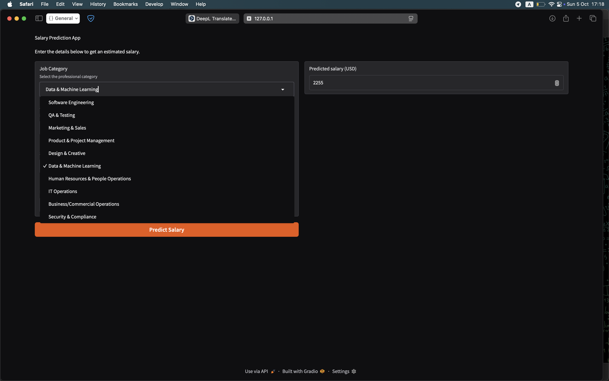
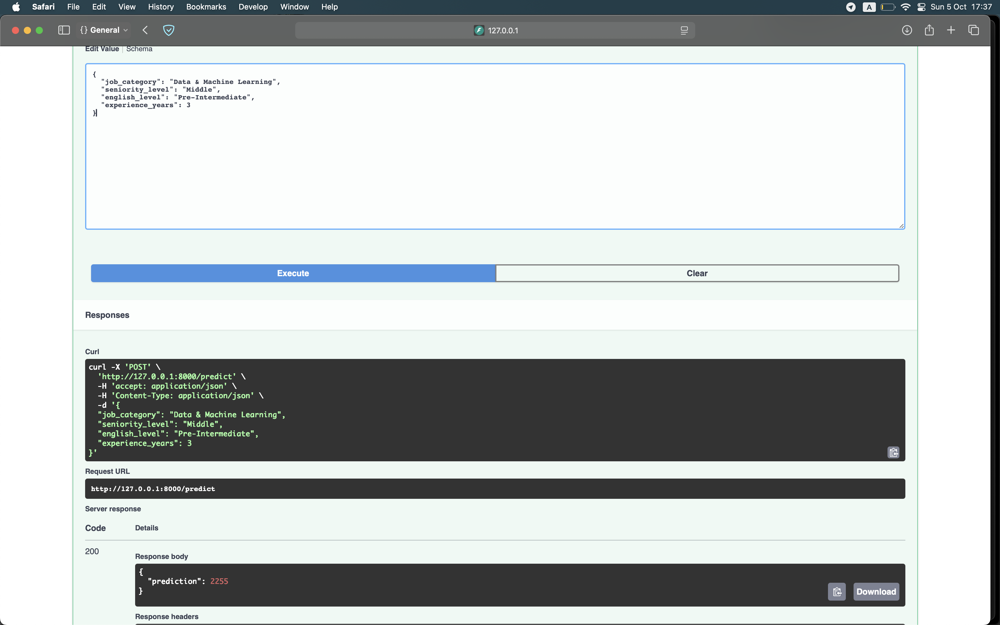

# IT Salary Predictor

Короткий опис: Проєкт для передбачення ІТ зарплат в Україні на основі даних 2025 року з DOU. Реалізовано повний ML-пайплайн від обробки даних до оцінки моделей, що демонструє практичне застосування машинного навчання для регресійних задач.

## Table of Contents
- [Motivation](#motivation)
- [Dataset](#dataset)
- [Project Structure](#project-structure)
- [API Interface](#api-interface)
- [Installation](#installation)
- [Usage](#usage)
- [Modeling Approach](#modeling-approach)
- [Evaluation](#evaluation)
- [Results](#results)
- [Examples](#examples)

## Motivation
- Формування pet-проєкту у портфоліо.
- Демонстрація та опрацювання практичних навичок для реалізації **повного циклу ML-проєкту**.

## Dataset
- Джерело: [DOU](https://dou.ua/)
- Обсяг: ~11,000 сирих записів, після очищення – ~3,000
- Формат: CSV

## Project Structure

├── app
│   ├── api.py # FastAPI модуль
│   ├── gradio.py # інтерфейс для передбачення
│   ├── main.py
│   └── models.py # pydantic частина
├── configs # конфіги для бек-енду
├── data # дані
├── logs
├── models # модель та мета-дані
├── notebooks # записники: експерименти, підготовка і обробка даних
├── README.md
├── src
│   ├── scripts
|       └── encoders.py # сформовано Claude AI
|       └── prediction.py # основна функція передбачення
│   └── utils
|       └── paths.py # шляхи
├── tests # тестування

---
## Api interface

| Endpoint   | Метод | Опис                                                                 |
|-------------|-------|----------------------------------------------------------------------|
| `/predict`  | POST  | Приймає характеристики кандидата, передає їх у модель і повертає прогноз зарплати (USD). |

> API побудовано на FastAPI.
> Вхідні дані проходять валідацію через Pydantic
> Відповідь — JSON з одним полем `prediction`.

## Installation
- Встановлення пакетів через requirements.txt
```bash
git clone https://github.com/vpleshko-lab/end2end-salary-predict
cd end2end-salary-predict
pip install -r requirements.txt
```

## Usage
- Запуск локально через Uvicorn -> [Local: 127.0.0.1:8000/docs](http://127.0.0.1:8000/docs)
```bash
uvicorn app.api:app
```
- Запуск інтерфейсу на базі Gradio -> [Local: 127.0.0.1:7860]( http://127.0.0.1:7860)
```bash
python -m app.gradio
```

## Modeling Approach
Тип задачі:
- регресія (прогнозування зарплат)
Пайплайн:
 1. Масштабний препроцесинг та очищення даних:
    Уніфікація фіч seniority_level → experience_years і seniority_level → salary_usd
(для боротьби з фейковими даними)
 2. Застосування frequency & target encoding для категоріальних фіч (створено з допомогою Claude AI)
 3. Тренування багатьох алгоритмів регресії через циклічний GridSearch, автоматичне порівняння продуктивності та автоматичний експорт найефективнішої моделі.

## Evaluation
Метрики для найкращої моделі (RandomForest):
- R² = 0.79
- MAE = 658
- RMSE = 933

## Examples

[]

