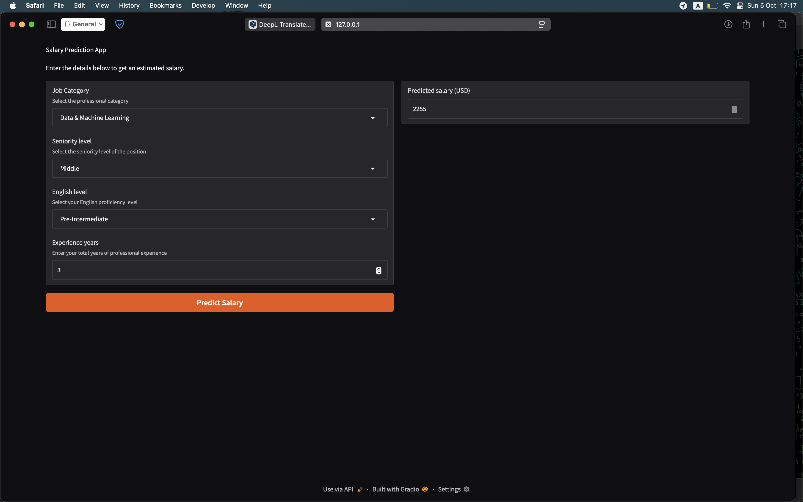
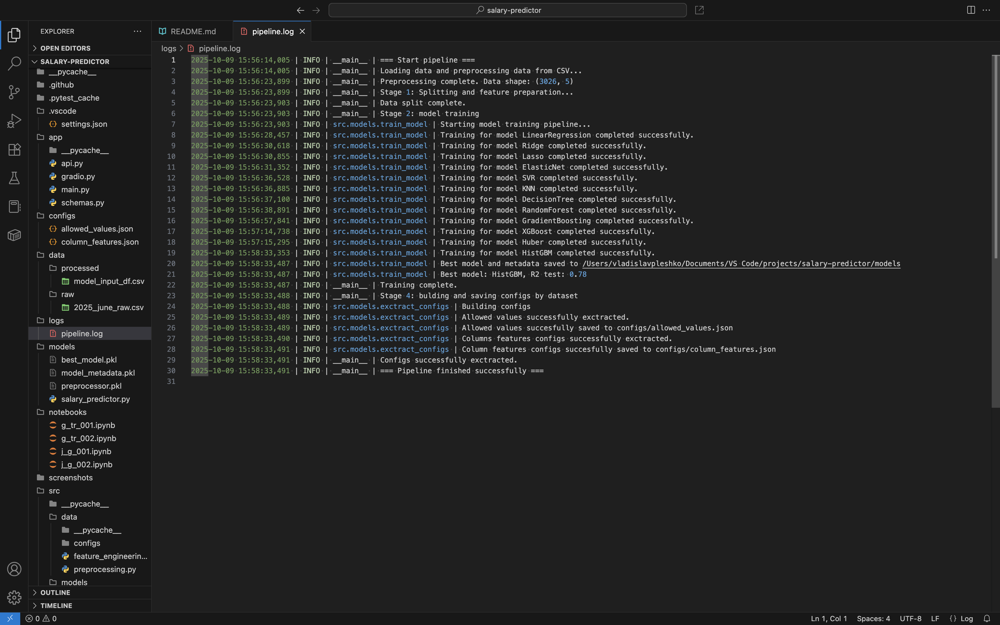

# IT Salary Predictor

### Короткий опис:
Проєкт для прогнозування ІТ зарплат в Україні на основі даних 2025 року з DOU. Реалізовано повний ML-пайплайн: від обробки даних та feature engineering до тренування моделей та API/інтерфейсу для предиктів. Проєкт демонструє практичне застосування машинного навчання для регресійних задач.

## Table of Contents
- [Motivation](#motivation)
- [Dataset](#dataset)
- [Project Structure](#project-structure)
- [API Interface](#api-interface)
- [Installation](#installation)
- [Usage](#usage)
- [Modeling Approach](#technical-overview--pipeline-architecture)
- [Evaluation](#evaluation)
- [Results](#results)
- [Examples](#examples)

## Motivation
- Pet-проєкт для портфоліо.
- Демонстрація практичних навичок реалізації повного циклу ML-проєкту, включно з preprocessing, feature engineering, тренуванням, деплоєм моделі та API/Gradio інтерфейсом.

## Dataset
- Джерело: [DOU](https://dou.ua) | [Data-link](https://github.com/devua/csv/blob/master/salaries/2025_june_raw.csv)
- Обсяг: ~11,000 сирих записів, після очищення ~3,000
- Формат: CSV
- Основні колонки: `job_category`, `seniority_level`, `english_level`, `experience_years`, `salary_usd`

## Project Structure
```css
├── app
│   ├── api.py          # API для передбачення (FastAPI)
│   ├── gradio.py       # Веб-інтерфейс Gradio для інтерактивного тестування
│   └── schemas.py      # Pydantic-схеми для валідації запитів/відповідей
│
├── configs
│   ├── allowed_values.json     # Список допустимих значень фіч для бек-енду
│   └── column_features.json    # Метадані колонок, використаних у моделі
│
├── data
│   ├── raw/                   # Початкові сирі дані (з DOU)
│   └── processed/             # Підготовлені дані після препроцесингу
│
├── logs
│   └── pipeline.log           # Логування виконання ML-пайплайну
│
├── models
│   ├── best_model.pkl         # Збережена найкраща модель
│   ├── model_metadata.pkl     # Метадані моделі (гіперпараметри, версія тощо)
│   ├── preprocessor.pkl       # Об’єкт препроцесингу (енкодери, скейлери)
│   └── salary_predictor.py    # Головний клас SalaryPredictor для передбачень
│
├── notebooks/                 # Експериментальні ноутбуки (EDA, моделювання)
|
├── screenshots/               # Візуальні приклади (Gradio, API)
|
├── src
│   ├── data/
│   │   ├── configs/               # Конфіги для обробки даних
│   │   ├── preprocessing.py       # Модуль: обробка сирих даних
│   │   └── feature_engineering.py # Модуль: інженерія ознак
│   │
│   ├── models/
│   │   ├── configs/                   # Конфіги моделей та їх гіперпараметри
│   │   ├── prepare_training_data.py  # Модуль: підготовка даних на вхід у тренування
│   │   ├── train_model.py            # Модуль: Навчання моделей і пошук гіперпараметрів
│   │   └── exctract_configs.py       # Модуль: формування конфігів для подальшого використання у деплої
│   │
│   ├── utils/
│   │   ├── logger.py   # Модуль: конфігурація логування
│   │   └── paths.py    # Централізовані шляхи до файлів та директорій
│   │
│   ├── scripts/
│   │   └── encoders.py  # Кастомні енкодери (frequency/target encoding)
│   │
│   └── pipeline.py      # Головний ML-пайплайн: від препроцесингу, тренування та експорту конфігів
│
├── tests/                # Тести для пайплайну та передбачень
│   ├── test_pipeline.py
│   └── test_prediction.py
│
├── configs/              # JSON-конфіги для API/Gradio
├── requirements.txt      # Залежності проєкту
├── requirements.in       # Базові пакети перед компіляцією у .txt
├── README.md
└── logs/                 # Файли логів виконання

```
---
## Api interface

| Endpoint   | Метод | Опис                                                                 |
|-------------|-------|----------------------------------------------------------------------|
| `/predict`  | POST  | Приймає характеристики кандидата, передає їх у модель і повертає передбачення зарплати (USD)|

> API побудовано на FastAPI.
> Вхідні дані проходять валідацію через Pydantic
> Відповідь — JSON з одним полем `prediction`.

## Installation
- Встановлення пакетів через requirements.txt
```bash
git clone https://github.com/vpleshko-lab/end2end-salary-predict
cd end2end-salary-predict
pip install -r requirements.txt
```

## Usage
### Запуск локально через Uvicorn
```bash
uvicorn app.api:app
```
- Доступна документація Swagger: http://127.0.0.1:8000/docs

### Запуск інтерфейсу на базі Gradio
```bash
python -m app.gradio
```
- Локальний інтерфейс: http://127.0.0.1:7860

## Technical Overview & Pipeline Architecture
### Тип задачі
- Регресія: прогнозування рівня зарплати в ІТ-сфері України.
### Цільова змінна: `salary_usd`.
### Архітектура пайплайну:
1. Data Preprocessing
   - Очищення та уніфікація даних (узгодження seniority_level → experience_years, фільтрація аномалій у salary_usd).
   - Розділення на raw та processed дані для відтворюваності.
2. Feature Engineering:
   - Застосовано frequency encoding і target encoding для категоріальних фіч.
   - Стандартизація ключових змінних (`position`).
3. Model Training
- Циклічний GridSearchCV для підбору гіперпараметрів кількох регресійних алгоритмів.
- Автоматичне порівняння продуктивності моделей та експорт найкращої.
4. Production Readiness
- Автоматичне збереження ознак і допустимих значень у JSON-конфіга
- Параметри контролюють збереження артефактів без редагування коду.
- Централізована структура конфігів (configs/) і логів (logs/).
- Валідація вхідних запитів через Pydantic-схеми (schemas.py).
- Модульні тести для пайплайну та API.
- Збереження артефактів (best_model.pkl, preprocessor.pkl, model_metadata.pkl) для швидкого деплою.
- **Проєкт побудовано за принципами відтворюваного, модульного та продакшн-орієнтованого ML-процесу, що відповідає стандартам інженерного рівня (data → model → API → UI)**.
## Evaluation
Метрики для найкращої моделі (HistGBM):
- R² = 0.78

## Examples




